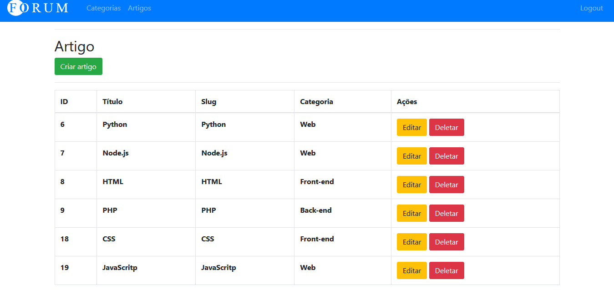

<h1 align="center">
  Projeto Blog de Artigos
 
</h1>

  <a href="#-tecnologias">Tecnologias</a>&nbsp;&nbsp;&nbsp;|&nbsp;&nbsp;&nbsp;
  <a href="#-projeto">Projeto</a>&nbsp;&nbsp;&nbsp;|&nbsp;&nbsp;&nbsp;
  <a href="#-deploy">Deploy</a>&nbsp;&nbsp;&nbsp;|&nbsp;&nbsp;&nbsp;
  <a href="#-autor">Autor</a>

 

 

  
  
  
  

## 🚀 Tecnologias

Esse projeto foi desenvolvido com as seguintes tecnologias:

- HTML
- EJS
- CSS
- JS
- Node.js
- Express.js
- MySQL

## 💻 Projeto

Este projeto consiste na ideia de um blog para armazenar dados de caráter científico e acadêmico, sendo este responsivo e utilizando de diversas ferramentas como Node.js, HTML, Java Script entre outros... Que tornaram esta aplicação possível.

Este projeto foi realizado por:

- Ariel Xavier;

Obs: Esta aplicação pode ser utilizada em quaiquer aparelhos celular e/ou desktop

---

## 🦸 Autor

<a href="https://www.linkedin.com/in/ariel-xavier-2b1960190/">
 
  
 <b>Ariel Xavier</b></a>
  

 

---

Feito por Ariel Xavier [Entre em contato!](https://www.linkedin.com/in/ariel-xavier-2b1960190/)

---
